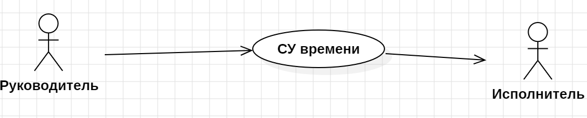

# Видение системы учета рабочего времени

## Даты внесения изменений

| Версия | Дата | Описание | Автор |
|---|---|---|---|
| Черновой начальный вариант | 06 сентября, 2025 | Первый черновой вариант. Будет уточнен на стадии развития | Коровина Виктория |

## Введение

Нам видится надежная система учета рабочего времени (TimeTracker), обеспечивающая полный контроль над задачами и рабочем временем. Данная система помогает руководителем  видеть реальную загрузку сотрудников и следить за сроками, а сотрудникам — легко фиксировать время на задачи. TimeTracker устраняет проблему в планировании и отчетности, предоставляя руководителям объективные данные для принятия управленческих решений, а исполнителям — удобный инструмент для точного учета своей работы. Благодаря гибким настройкам и интеграции с другими программами, TimeTracker становится удобным центром управления рабочим временем.

## Позиционирование

### Экономические предпосылки

Существующие решения для учета рабочего времени часто являются либо избыточно сложными и дорогими, либо слишком упрощенными и негибкими (простые трекеры времени). Такие решения недостаточно масштабируемы, плохо интегрируются с другими корпоративными системами и не предоставляют достаточной аналитики для принятия управленческих решений. Отсутствие автоматизации процессов учета времени приводит к значительным потерям времени и ресурсов. Это всё создает рыночную нишу для доступного, но мощного решения, которое можно адаптировать под специфические бизнес-процессы.

### Формулировка проблемы

Традиционные системы учета рабочего времени не обладают гибкостью, недостаточно автоматизированы и не обеспечивают полноценной интеграции с внешними системами. Это приводит к проблемам с планированием ресурсов, достоверностью данных о рабочем времени, несоответствием программного обеспечения реальным бизнес-процессам компаний, отсутствием прозрачности в распределении рабочей нагрузки, сложностью анализа производительности труда и неточному расчету заработной платы. Эти проблемы касаются руководителей организаций, исполнители, бухгалтерии, HR-специалисты и системных администраторов

### Место системы
TimeTracker предназначена для организаций малого и среднего бизнеса, а также крупных предприятий, требующих эффективного управления человеческими ресурсами и контроля производительности труда.

Основные свойства системы:

  - Автоматизированный учет рабочего времени с минимальным участием пользователя
  - Глубокая аналитика производительности и загрузки сотрудников
  - Гибкая система настраиваемых бизнес-правил и отчетности
  - Полноценная интеграция с популярными внешними системами
  - Масштабируемая архитектура, адаптируемая под потребности бизнеса

Ключевое отличие — гибкость на основе бизнес-правил, позволяющая адаптировать систему под процессы заказчика без программирования.

## Заинтересованные лица

### 1) Для кого предназначена система и каковы проблемы заинтересованных лиц:
Система предназначена для широкого круга организаций (малый, средний и крупный бизнес), который требует эффективное управления человеческими ресурсами и контроль производительности труда. Проблемы заинтересованных лиц связаны с отсутствием прозрачности, автоматизации и достоверных данных в процессе учета рабочего времени.
### 2) Демографические особенности рынка:
Это коммерческие и некоммерческие организации в сегменте B2B (компания продает TimeTracker другой компании ), чья деятельность носит проектный характер или требует почасового учета труда. Это включает IT-компании, консалтинговые агентства, дизайн-студии, строительные и инжиниринговые компании, юридические фирмы, маркетинговые отделы и научно-исследовательские институты.

### 3) Заинтересованные лица, не являющиеся пользователями системы:
- **Собственники бизнеса / Инвесторы:** заинтересованы в повышении общей эффективности компании, но не используют систему напрямую.
- **Клиенты компании:** косвенно заинтересованы в точном учете времени, так как это влияет на прозрачность счетов, но не являются пользователями системы.
  
### 4) Пользователи системы:

- **Руководитель**: Создание заданий, назначение исполнителей, контроль сроков, утверждение отчетов
- **Исполнитель**: Фиксация времени работы, формирование отчетов
- **HR-менеджер**: Анализ загрузки сотрудников, планирование ресурсов
- **Бухгалтер**: Получение данных для расчета заработной платы
- **Администратор**: Управление пользователями, настройка системы, техническая поддержка

### Основные задачи высокого уровня и проблемы заинтересованных лиц

| Цель высокого уровня | Приоритет | Проблемы и замечания | Текущие решения |
|---|---|---|---|
| Автоматизированный, точный и прозрачный учет рабочего времени | Высокий | Учет ведется вручную в электронных таблицах или на бумаге. Данные неточные, поступают с задержкой, их легко подделать или потерять. Нет привязки к конкретным задачам и проектам. | **Электронные таблицы:** Ручное заполнение шаблонов, консолидация данных, высокий риск ошибок.**Бумажные журналы:** Ежедневное заполнение бланков, физическое хранение, сложность анализа. **Упрощенные трекеры:** Бесплатные приложения с ограниченным функционалом, проблемы с интеграцией и безопасностью. |
| Повышение производительности и эффективности труда | Высокий | Руководство не видит реальной загрузки команд. Невозможно определить, на какие задачи уходит больше всего времени. | Принятие управленческих решений на основе интуиции, а не данных. Микроменеджмент.|
| Интеграция с системами расчета ЗП | Высокий | Данные не синхронизируются с системами управления проектами, бухгалтерскими программами. При сбоях учет прекращается. | Данные вручную переносятся из одной системы в другую. Двойной ввод информации. Риск потери данных при сбоях.|
| Гибкая настройка под уникальные бизнес-процессы | Средний | Жесткие системы не позволяют настроить правила назначения задач, утверждения отчетов, учета времени так, как это принято в компании. Требуются дорогостоящие доработки. | Компании вынуждены менять свои процессы под ограничения ПО, что снижает эффективность, или продолжать работать вручную.|

## Задачи уровня пользователя

- **Руководитель**: Создание заданий, назначение исполнителей, контроль сроков, утверждение отчетов
- **Исполнитель**: Фиксация времени работы, ведение таймшитов, формирование отчетов
- **HR-менеджер**: Анализ загрузки сотрудников, планирование ресурсов
- **Бухгалтер**: Получение данных для расчета заработной платы
- **Администратор**: Управление пользователями, настройка системы, техническая поддержка

## Обзор

### Перспективы продукта

Система TimeTracker будет развертываться как кроссплатформенное веб-приложение с мобильным доступом. Система может быть размещена в облачной инфраструктуре или на собственных серверах компании. Она будет обслуживать пользователей через веб-интерфейс и мобильные приложения, а также взаимодействовать с другими корпоративными системами.

### Преимущества системы

| Свойство | Преимущества для заинтересованных лиц |
|---|---|
| Автоматизированный учет времени | **Руководители** получают точные данные о загрузке сотрудников. **Исполнители** экономят время на составлении отчетов. **Бухгалтерия** получает достоверные данные для расчета ЗП. |
| Гибкая система бизнес-правил | **Администраторы** могут настраивать логику работы без программирования. **Компания** быстро адаптирует систему под изменяющиеся бизнес-процессы. |
| Глубокая аналитика и отчетность | **Руководители** могут анализировать производительность и эффективность работы. **HR-специалисты** получают инструменты для планирования ресурсов. |
| Мобильность и доступность | Возможность работы из любой точки мира |
| Интеграция с внешними системами | **Бухгалтерия** автоматически получает данные для расчета заработной платы. **Компания** обеспечивает единое информационное пространство. |

### Предположения и зависимости
- Наличие стабильного интернет-соединения для работы облачной версии
- Совместимость с современными веб-браузерами и мобильными ОС
- Наличие квалифицированного администратора для первоначальной настройки
  
### Стоимость и ценообразование
- Помесячная или годовая подписка на пользователя
- Корпоративные лицензии для неограниченного числа пользователей
- Дополнительные услуги по внедрению и технической поддержке
  
### Лицензирование и установка
- Возможность установки на собственные серверы (on-premise)
- Бесплатный пробный период на 14-30 дней
  
## Основные свойства системы

1. **Учет рабочего времени** - автоматический и ручной ввод данных
2. **Управление задачами** - создание, назначение, контроль выполнения
3. **Отчетность и аналитика** - готовые отчеты и customizable дашборды
4. **Интеграция с внешними системами** (ERP, CRM, 1С, Jira)
5. **Гибкая система уведомлений** - email, push, in-app
6. **Мобильные приложения** - iOS и Android
7. **Система ролей и прав доступа**
8. **API для интеграции** - RESTful API
9. **Резервное копирование и восстановление**
10. **Многоязычная поддержка**

## Другие требования и ограничения

### Технические требования

- Поддержка современных браузеров
- Responsive design для мобильных устройств
- Интеграция с Active Directory/LDAP
- Поддержка SSL/TLS шифрования
- Репликация данных для обеспечения отказоустойчивости
- Система логирования и аудита

### Ограничения

- Минимальные требования к аппаратному обеспечению
- Требования к пропускной способности сети
- Совместимость с определенными версиями ОС и браузеров
- Ограничения по количеству одновременных пользователей в зависимости от лицензии
