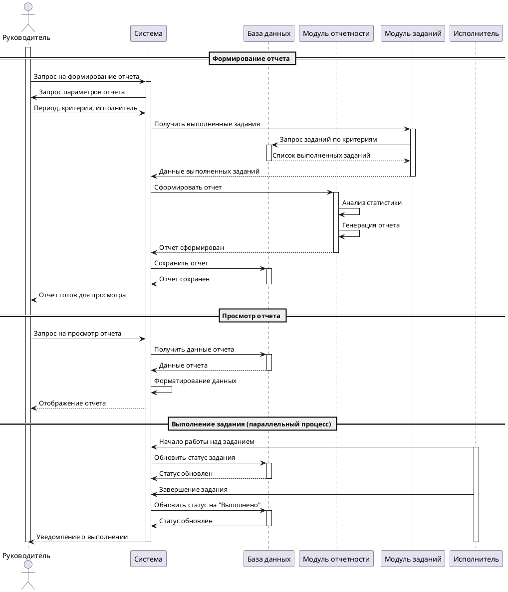

# Диаграмма последовательности: Формирование и просмотр отчета

```plantuml
@startuml
actor Руководитель
participant "Система" as Система
participant "База данных" as БД
participant "Модуль отчетности" as Отчетность
participant "Модуль заданий" as Задания
participant "Исполнитель" as Исполнитель

activate Руководитель

== Формирование отчета ==
Руководитель -> Система: Запрос на формирование отчета
activate Система
Система -> Руководитель: Запрос параметров отчета
Руководитель -> Система: Период, критерии, исполнитель
Система -> Задания: Получить выполненные задания
activate Задания
Задания -> БД: Запрос заданий по критериям
activate БД
БД --> Задания: Список выполненных заданий
deactivate БД
Задания --> Система: Данные выполненных заданий
deactivate Задания

Система -> Отчетность: Сформировать отчет
activate Отчетность
Отчетность -> Отчетность: Анализ статистики
Отчетность -> Отчетность: Генерация отчета
Отчетность --> Система: Отчет сформирован
deactivate Отчетность

Система -> БД: Сохранить отчет
activate БД
БД --> Система: Отчет сохранен
deactivate БД
Система --> Руководитель: Отчет готов для просмотра

== Просмотр отчета ==
Руководитель -> Система: Запрос на просмотр отчета
Система -> БД: Получить данные отчета
activate БД
БД --> Система: Данные отчета
deactivate БД
Система -> Система: Форматирование данных
Система --> Руководитель: Отображение отчета

== Выполнение задания (параллельный процесс) ==
Исполнитель -> Система: Начало работы над заданием
activate Исполнитель
Система -> БД: Обновить статус задания
activate БД
БД --> Система: Статус обновлен
deactivate БД

Исполнитель -> Система: Завершение задания
Система -> БД: Обновить статус на "Выполнено"
activate БД
БД --> Система: Статус обновлен
deactivate БД
Система --> Руководитель: Уведомление о выполнении
deactivate Исполнитель

deactivate Система
deactivate Руководитель
@enduml
```
