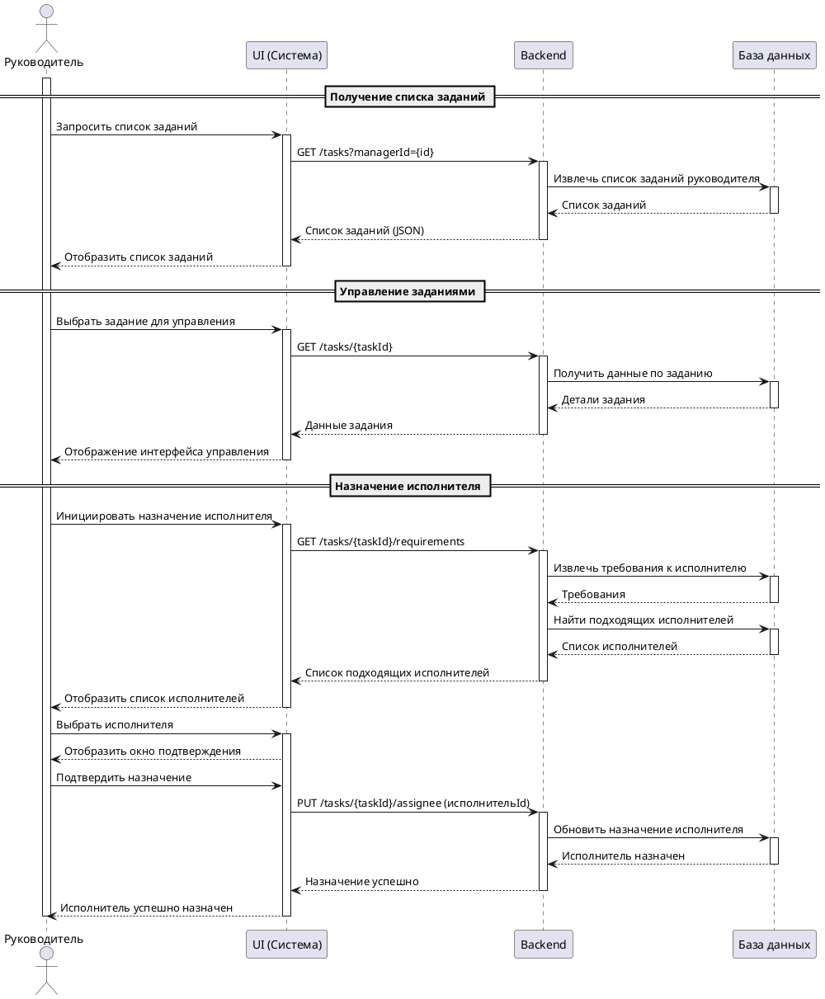

```plantuml
@startuml
actor Руководитель
participant "UI (Система)" as UI
participant "Backend" as BE
participant "База данных" as DB

activate Руководитель

== Получение списка заданий ==
Руководитель -> UI: Запросить список заданий
activate UI
UI -> BE: GET /tasks?managerId={id}
activate BE
BE -> DB: Извлечь список заданий руководителя
activate DB
DB --> BE: Список заданий
deactivate DB
BE --> UI: Список заданий (JSON)
deactivate BE
UI --> Руководитель: Отобразить список заданий
deactivate UI

== Управление заданиями ==
Руководитель -> UI: Выбрать задание для управления
activate UI
UI -> BE: GET /tasks/{taskId}
activate BE
BE -> DB: Получить данные по заданию
activate DB
DB --> BE: Детали задания
deactivate DB
BE --> UI: Данные задания
deactivate BE
UI --> Руководитель: Отображение интерфейса управления
deactivate UI

== Назначение исполнителя ==
Руководитель -> UI: Инициировать назначение исполнителя
activate UI
UI -> BE: GET /tasks/{taskId}/requirements
activate BE
BE -> DB: Извлечь требования к исполнителю
activate DB
DB --> BE: Требования
deactivate DB

BE -> DB: Найти подходящих исполнителей
activate DB
DB --> BE: Список исполнителей
deactivate DB
BE --> UI: Список подходящих исполнителей
deactivate BE
UI --> Руководитель: Отобразить список исполнителей
deactivate UI

Руководитель -> UI: Выбрать исполнителя
activate UI
UI --> Руководитель: Отобразить окно подтверждения
Руководитель -> UI: Подтвердить назначение

UI -> BE: PUT /tasks/{taskId}/assignee (исполнительId)
activate BE
BE -> DB: Обновить назначение исполнителя
activate DB
DB --> BE: Исполнитель назначен
deactivate DB
BE --> UI: Назначение успешно
deactivate BE
UI --> Руководитель: Исполнитель успешно назначен
deactivate UI
deactivate Руководитель
@enduml
```
