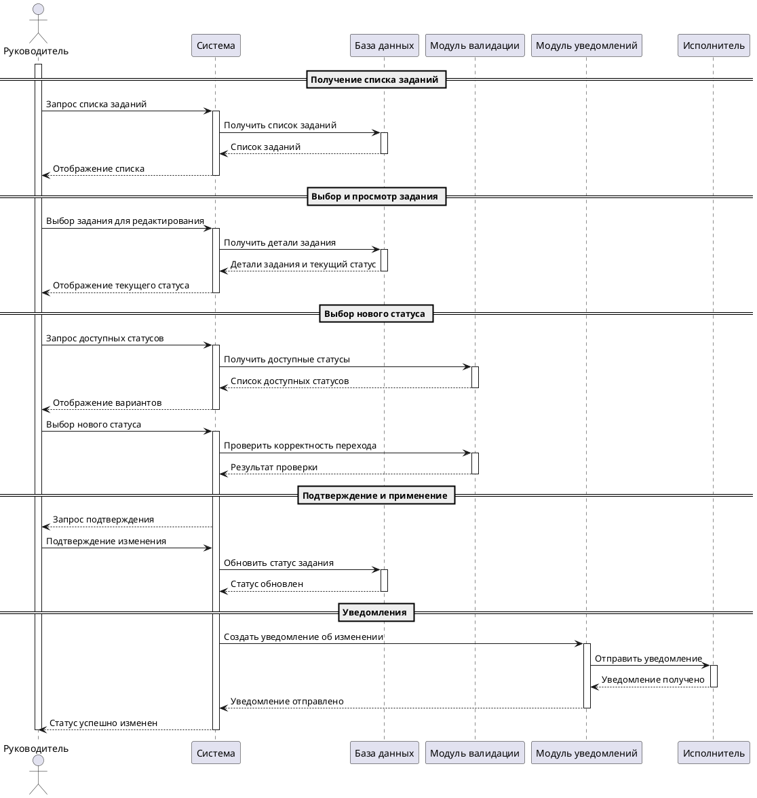

```plantuml
@startuml
actor Руководитель
participant "Система" as Система
participant "База данных" as БД
participant "Модуль валидации" as Валидация
participant "Модуль уведомлений" as Уведомления
participant "Исполнитель" as Исполнитель

activate Руководитель

== Получение списка заданий ==
Руководитель -> Система: Запрос списка заданий
activate Система
Система -> БД: Получить список заданий
activate БД
БД --> Система: Список заданий
deactivate БД
Система --> Руководитель: Отображение списка
deactivate Система

== Выбор и просмотр задания ==
Руководитель -> Система: Выбор задания для редактирования
activate Система
Система -> БД: Получить детали задания
activate БД
БД --> Система: Детали задания и текущий статус
deactivate БД
Система --> Руководитель: Отображение текущего статуса
deactivate Система

== Выбор нового статуса ==
Руководитель -> Система: Запрос доступных статусов
activate Система
Система -> Валидация: Получить доступные статусы
activate Валидация
Валидация --> Система: Список доступных статусов
deactivate Валидация
Система --> Руководитель: Отображение вариантов
deactivate Система

Руководитель -> Система: Выбор нового статуса
activate Система
Система -> Валидация: Проверить корректность перехода
activate Валидация
Валидация --> Система: Результат проверки
deactivate Валидация

== Подтверждение и применение ==
Система --> Руководитель: Запрос подтверждения
Руководитель -> Система: Подтверждение изменения
Система -> БД: Обновить статус задания
activate БД
БД --> Система: Статус обновлен
deactivate БД

== Уведомления ==
Система -> Уведомления: Создать уведомление об изменении
activate Уведомления
Уведомления -> Исполнитель: Отправить уведомление
activate Исполнитель
Исполнитель --> Уведомления: Уведомление получено
deactivate Исполнитель
Уведомления --> Система: Уведомление отправлено
deactivate Уведомления

Система --> Руководитель: Статус успешно изменен
deactivate Система
deactivate Руководитель
@enduml
```
