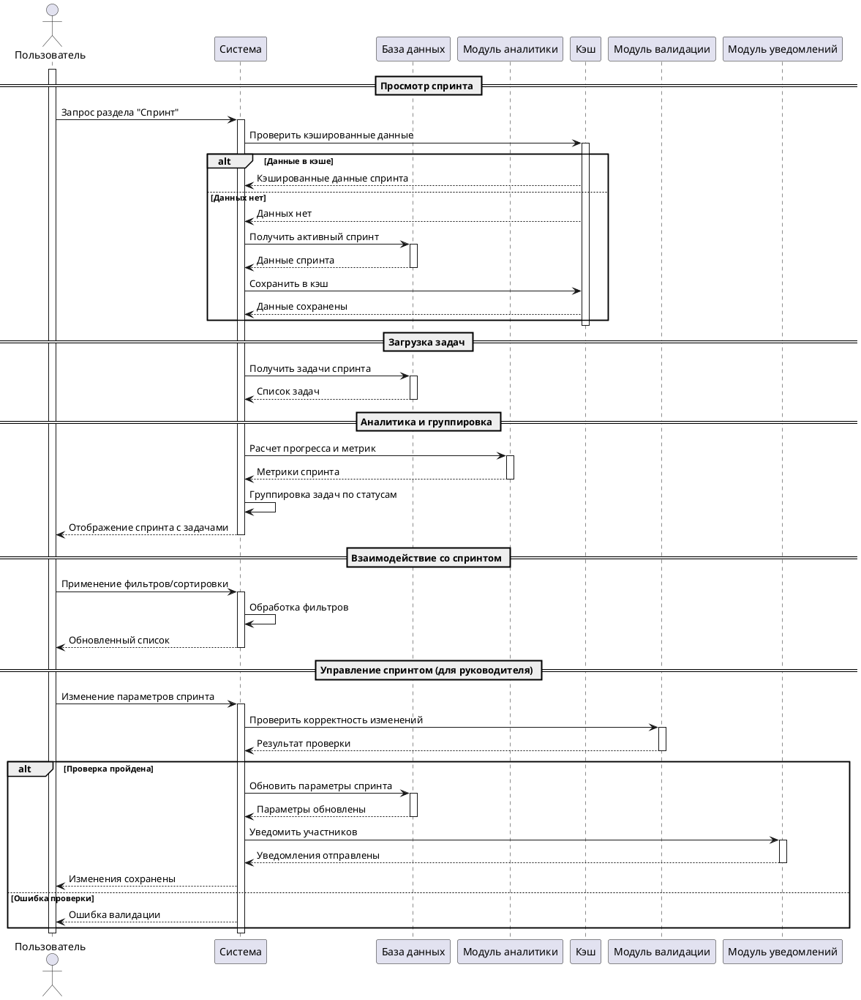

```plantuml
@startuml
actor Пользователь
participant "Система" as Система
participant "База данных" as БД
participant "Модуль аналитики" as Аналитика
participant "Кэш" as Кэш
participant "Модуль валидации" as Валидация
participant "Модуль уведомлений" as Уведомления

activate Пользователь

== Просмотр спринта ==
Пользователь -> Система: Запрос раздела "Спринт"
activate Система

Система -> Кэш: Проверить кэшированные данные
activate Кэш
alt Данные в кэше
    Кэш --> Система: Кэшированные данные спринта
else Данных нет
    Кэш --> Система: Данных нет
    Система -> БД: Получить активный спринт
    activate БД
    БД --> Система: Данные спринта
    deactivate БД
    Система -> Кэш: Сохранить в кэш
    Кэш --> Система: Данные сохранены
end
deactivate Кэш

== Загрузка задач ==
Система -> БД: Получить задачи спринта
activate БД
БД --> Система: Список задач
deactivate БД

== Аналитика и группировка ==
Система -> Аналитика: Расчет прогресса и метрик
activate Аналитика
Аналитика --> Система: Метрики спринта
deactivate Аналитика

Система -> Система: Группировка задач по статусам
Система --> Пользователь: Отображение спринта с задачами
deactivate Система

== Взаимодействие со спринтом ==
Пользователь -> Система: Применение фильтров/сортировки
activate Система
Система -> Система: Обработка фильтров
Система --> Пользователь: Обновленный список
deactivate Система

== Управление спринтом (для руководителя) ==
Пользователь -> Система: Изменение параметров спринта
activate Система
Система -> Валидация: Проверить корректность изменений
activate Валидация
Валидация --> Система: Результат проверки
deactivate Валидация

alt Проверка пройдена
    Система -> БД: Обновить параметры спринта
    activate БД
    БД --> Система: Параметры обновлены
    deactivate БД
    
    Система -> Уведомления: Уведомить участников
    activate Уведомления
    Уведомления --> Система: Уведомления отправлены
    deactivate Уведомления
    
    Система --> Пользователь: Изменения сохранены
else Ошибка проверки
    Система --> Пользователь: Ошибка валидации
end
deactivate Система

deactivate Пользователь
@enduml
```
